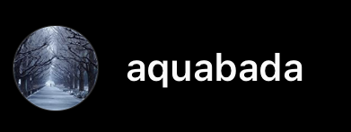
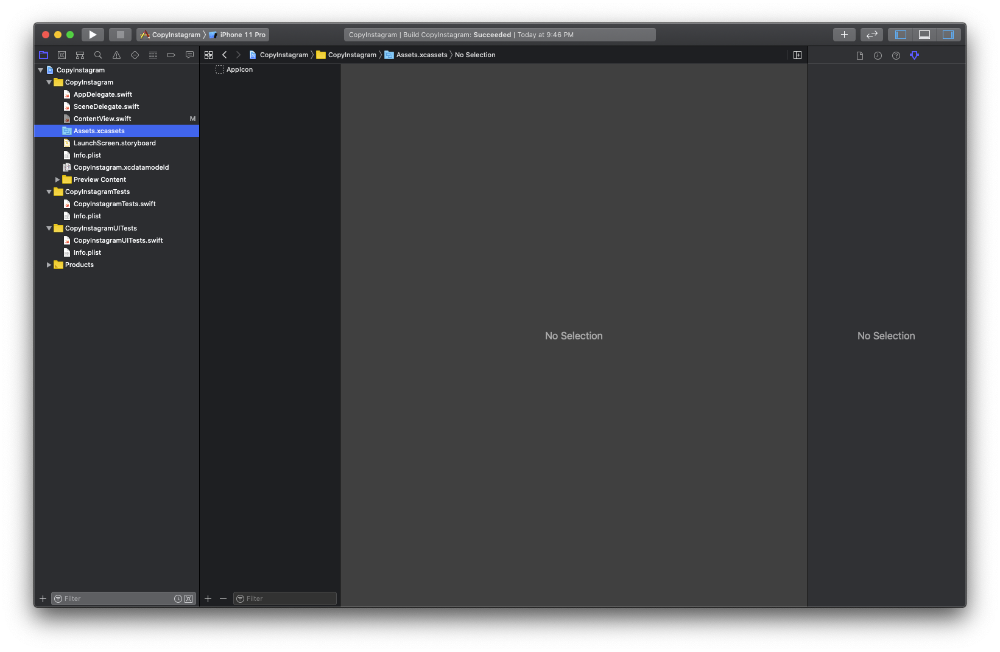
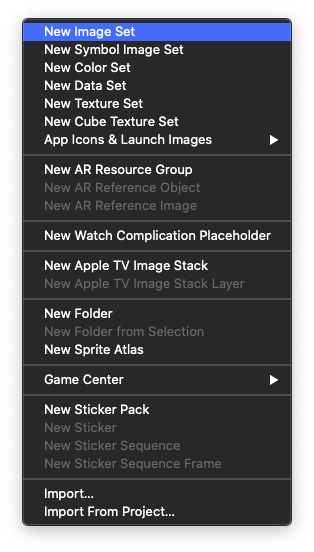
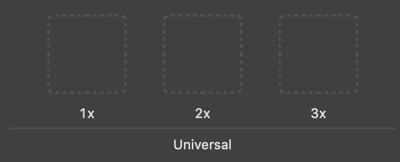
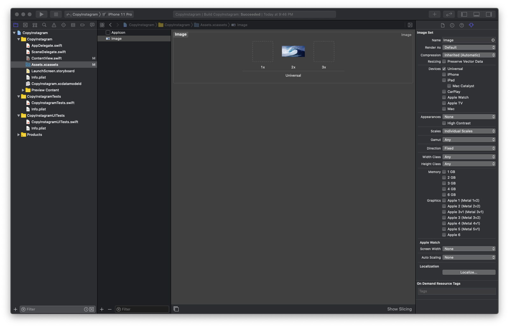
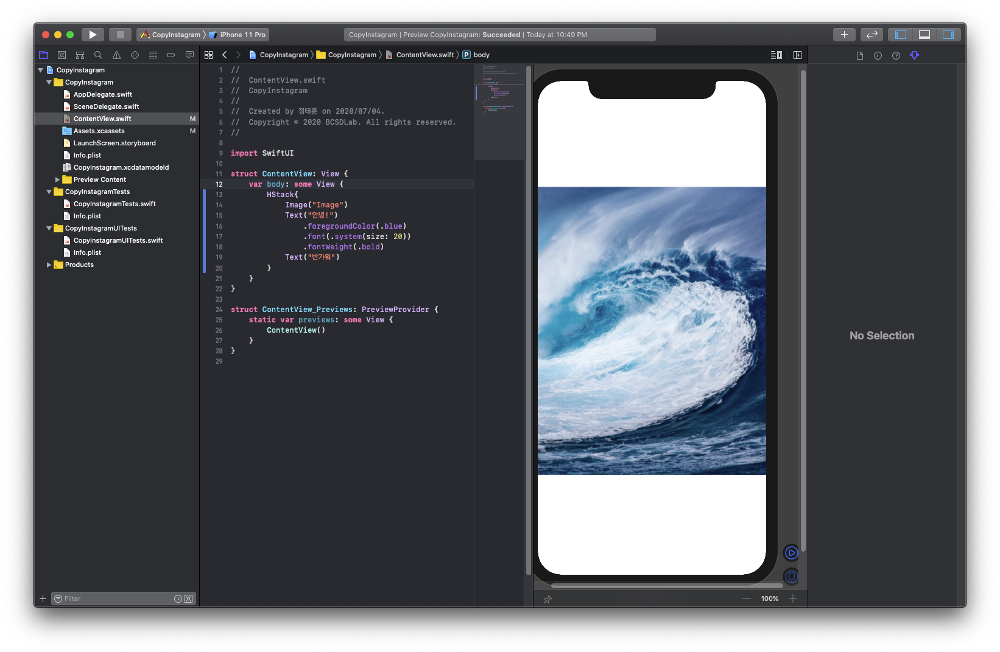
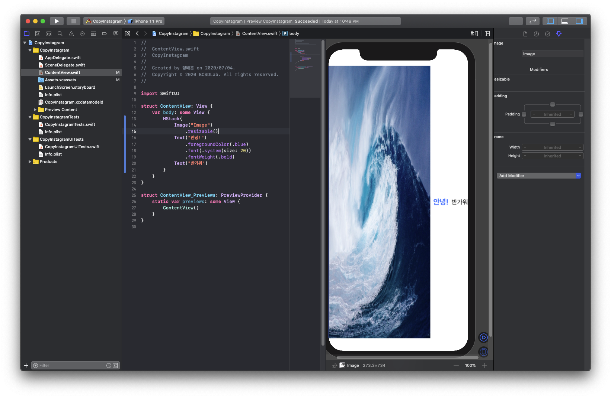
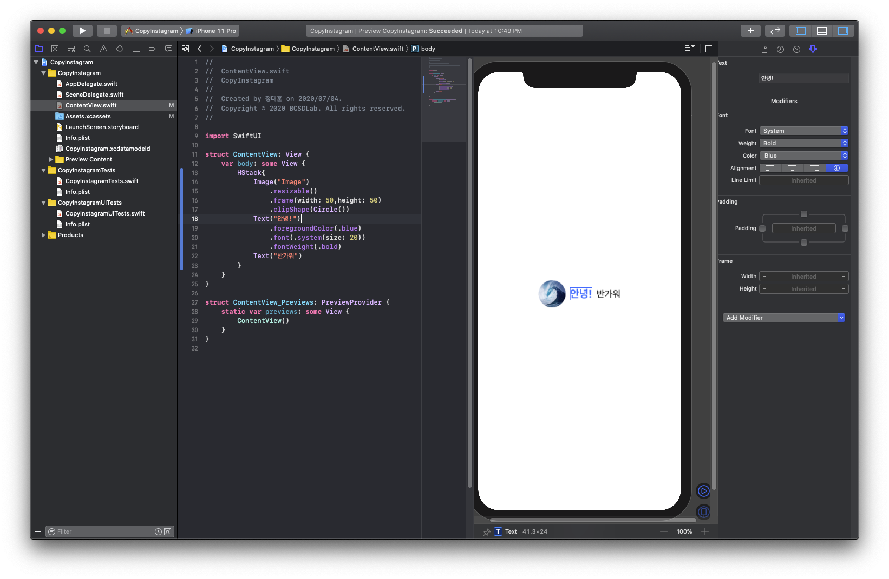
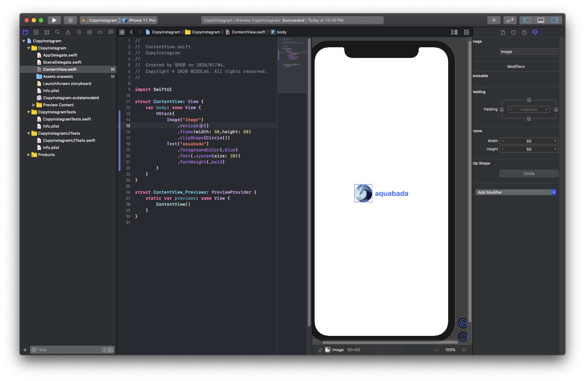

# 이미지 넣기\(Image\)

* 목표 : 프로필 사진 추가 



먼저 사진을 넣어보도록 합니다. 왼쪽 폴더 중 파란색 폴더로 되어있는 “Assets.xcassets”를 더블클릭해봅시다.



이제 여기에 사진을 추가하도록 해보도록 하겠습니다. AppIcon이라고 적혀있는 부분 맨 밑의 +와 -가 같이 있는 부분에서 + 버튼을 누르도록 합니다. 그러면 다음과 같은 화면이 나올겁니다.



여기에서 “New Image Set”을 누르도록 합시다.


그러면 다음과 같은 화면이 나오는데 2x부분에 원하는 이미지를 드래그하여 넣어보도록 합니다. 2x인 이유는 추후 설명하도록 하겠습니다.



그러면 이렇게 추가가 됩니다!



그러면 이제 이미지를 띄워보도록 합시다.

```swift
var body: some View {
    HStack{
        Image("Image") // "Image"라는 이름의 이미지를 추가
        Text("안녕!")
            .foregroundColor(.blue)
            .font(.system(size: 20))
            .fontWeight(.bold)
        Text("반가워")
    }
}
```



이미지가 커서 글자가 가려지네요. 이미지 크기를 조절해보도록 합시다.

```swift
var body: some View {
    HStack{
        Image("Image")
            .resizable() // 이미지 사이즈 조절할 때 넣는 함수
        Text("안녕!")
            .foregroundColor(.blue)
            .font(.system(size: 20))
            .fontWeight(.bold)
        Text("반가워")
    }
}
```



이제는 글자가 보이네요! 그래도 사진이 너무 큰 건 똑같은 상태라서 크기를 작게 설정해봅시다. 그리고 추가로 이미지를 동그랗게 만들어줍시다.

```swift
var body: some View {
    HStack{
        Image("Image")
            .resizable()
            .frame(width: 50, height: 50) // 가로 50, 세로 50으로 크기 조절
            .clipShape(Circle()) // 동그란 형태로 이미지를 잘라줍니다.
        Text("안녕!")
            .foregroundColor(.blue)
            .font(.system(size: 20))
            .fontWeight(.bold)
        Text("반가워")
    }
}
```



이제 프로필사진을 꾸며줬으니, 글자도 닉네임이 들어가는 것처럼 바꿔줍시다. 전에 복습한 것을 활용하며 만들어봅시다.

```swift
var body: some View {
    HStack{
        Image("Image")
            .resizable()
            .frame(width: 50, height: 50) // 가로 50, 세로 50으로 크기 조절
            .clipShape(Circle()) // 동그란 형태로 이미지를 잘라줍니다.
        Text("aquabada")
            .foregroundColor(.blue)
            .font(.system(size: 20))
            .fontWeight(.bold)
    }
}
```



