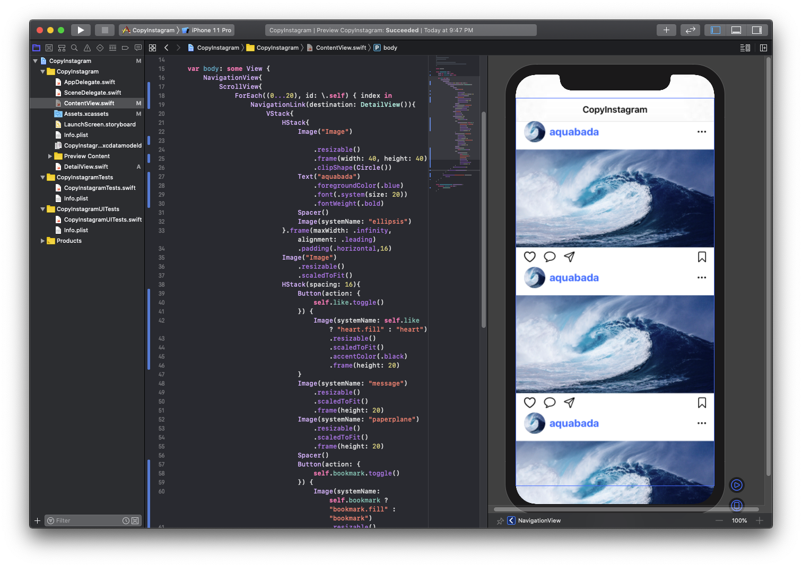

# 사진 누르면 해당 페이지로 이동\(NavigationView, NavigationLink\)


목표 : 사진을 누르면 다른 페이지로 이동할 수 있습니다.


먼저 새로운 페이지 하나를 만들어줍시다.

왼쪽 폴더에 오른쪽 버튼을 눌러 새로운 파일을 생성합시다.


그 다음 SwiftUI View를 선택하고 다음 버튼을 누릅니다.


이름을 만드는데, 전 “DetailView”로 만들었습니다.


그러면 새로운 뷰가 만들어집니다.


이 페이지를 꾸미는 건 나중에 만들어보고, 대신 들어갈 글자만 수정해보도록 합시다.

전 글자를 “사진이 들어갈 자리입니다”라고 바꿔보도록 하겠습니다.


그러면 다시 기존 페이지로 돌아가보도록 하겠습니다.


먼저 상위 뷰에 NavigationView를 추가하도록 합시다.

```swift
NavigationView{ // 네비게이션 생성
  ScrollView{
      ForEach((0...20), id: \.self) { index in
                VStack{
                    HStack{
                        Image("Image")
                            .resizable()
                            .frame(width: 40, height: 40)
                            .clipShape(Circle())
                        Text("aquabada")
                            .foregroundColor(.blue)
                            .font(.system(size: 20))
                            .fontWeight(.bold)
                        Spacer()
                        Image(systemName: "ellipsis")
                    }.frame(maxWidth: .infinity, alignment: .leading)
                        .padding(.horizontal,16)
                    Image("Image")
                        .resizable()
                        .scaledToFit()
                    HStack(spacing: 16){
                        Button(action: {
                            self.like.toggle()
                        }) {
                            Image(systemName: self.like ? "heart.fill" : "heart")
                                .resizable()
                                .scaledToFit()
                                .accentColor(.black)
                                .frame(height: 20)
                        }
                        Image(systemName: "message")
                            .resizable()
                            .scaledToFit()
                            .frame(height: 20)
                        Image(systemName: "paperplane")
                            .resizable()
                            .scaledToFit()
                            .frame(height: 20)
                        Spacer()
                        Button(action: {
                            self.bookmark.toggle()
                        }) {
                            Image(systemName: self.bookmark ? "bookmark.fill" : "bookmark")
                                .resizable()
                                .scaledToFit()
                                .accentColor(.black)
                                .frame(height: 20)
                        }
                    }.padding(.horizontal,16)
                }
            }
        }.navigationBarTitle("CopyInstagram") // 네비게이션 바 이름 설정
}
```


 그러면 위에 제목이 위에 표시됩니다. 이걸 SwiftUI에서는 네비게이션 바라고 얘기합니다.

_네비게이션 뷰, 네비게이션 바 정의_


iOS에서는 화면을 이동할 때 네비게이션을 이용하며, 네비게이션의 특징으로는 네비게이션 바가 상단에 위치해있습니다. 이 네비게이션 바를 통해 화면을 이동할 수 있고, 제목을 통해 화면을 구분하고 있습니다.

이러한 네비게이션 기능을 구현해주는 뷰가 네비게이션 뷰이고, 네비게이션을 구현할 뷰에 감싸주면 사용 가능힙니다.

네비게이션 제목을 설정하려면, 네비게이션 뷰가 아닌 구현할 뷰에 다음과 같은 줄을 추가해주면 됩니다.

`.navigationBarTitle("CopyInstagram")`

_심화_: 제목 크기를 한 줄로 짧게 표현해봅시다.

* 힌트 : navigationBarTitle 내의 displayMode를 이용합니다.

답 : `.navigationBarTitle("CopyInstagram", displayMode: .inline)`


그러면 이제 누르면 화면을 이동할 수 있게 해봅시다.

```swift
NavigationView{
  ScrollView{
    VStack(spacing: 32){
        ForEach((0...20), id: \.self) { index in
            NavigationLink(destination: DetailView()){ // 누르면 DetailView로 이동
                            VStack{
                                HStack{
                                    Image("Image")
                                        .resizable()
                                        .frame(width: 40, height: 40)
                                        .clipShape(Circle())
                                    Text("aquabada")
                                        .foregroundColor(.blue)
                                        .font(.system(size: 20))
                                        .fontWeight(.bold)
                                    Spacer()
                                    Image(systemName: "ellipsis")
                                }.frame(maxWidth: .infinity, alignment: .leading)
                                    .padding(.horizontal,16)
                                Image("Image")
                                    .resizable()
                                    .scaledToFit()
                                HStack(spacing: 16){
                                    Button(action: {
                                        self.like.toggle()
                                    }) {
                                        Image(systemName: self.like ? "heart.fill" : "heart")
                                            .resizable()
                                            .scaledToFit()
                                            .accentColor(.black)
                                            .frame(height: 20)
                                    }
                                    Image(systemName: "message")
                                        .resizable()
                                        .scaledToFit()
                                        .frame(height: 20)
                                    Image(systemName: "paperplane")
                                        .resizable()
                                        .scaledToFit()
                                        .frame(height: 20)
                                    Spacer()
                                    Button(action: {
                                        self.bookmark.toggle()
                                    }) {
                                        Image(systemName: self.bookmark ? "bookmark.fill" : "bookmark")
                                            .resizable()
                                            .scaledToFit()
                                            .accentColor(.black)
                                            .frame(height: 20)
                                    }
                                }.padding(.horizontal,16)
                            }
                        }.buttonStyle(PlainButtonStyle())

                    }
                }.padding(.top, 32)
            }
            .navigationBarTitle("CopyInstagram", displayMode: .inline)
        }
```



NavigationLink를 이용하면 다른 화면으로 이동할 수 있습니다.

구조는 Button이랑 비슷한데 다른 점은 action 대신 destination을 통해 이동할 화면을 설정해주면 됩니다.

실행해보면 사진 누를 때 다른 페이지로 이동하는 걸 확인할 수 있습니다.

_복습_ 

ScrollView 사이 간격을 넓히고, 맨 위의 여백을 넣어주도록 합시다.

* VStack의 spacing을 이용하여 사이 여백을 32로 줍니다.
* VStack 위의 여백을 32로 줍니다.
* VStack은 ScrollView 내부에 있고, ForEach는 VStack 내부에 위치해줍니다.


답 :

```swift
NavigationView{
            ScrollView{
                VStack(spacing: 32){
                    ForEach((0...20), id: \.self) { index in
                        NavigationLink(destination: DetailView()){
                            VStack{
                                HStack{
                                    Image("Image")
                                        .resizable()
                                        .frame(width: 40, height: 40)
                                        .clipShape(Circle())
                                    Text("aquabada")
                                        .foregroundColor(.blue)
                                        .font(.system(size: 20))
                                        .fontWeight(.bold)
                                    Spacer()
                                    Image(systemName: "ellipsis")
                                }.frame(maxWidth: .infinity, alignment: .leading)
                                    .padding(.horizontal,16)
                                Image("Image")
                                    .resizable()
                                    .scaledToFit()
                                HStack(spacing: 16){
                                    Button(action: {
                                        self.like.toggle()
                                    }) {
                                        Image(systemName: self.like ? "heart.fill" : "heart")
                                            .resizable()
                                            .scaledToFit()
                                            .accentColor(.black)
                                            .frame(height: 20)
                                    }
                                    Image(systemName: "message")
                                        .resizable()
                                        .scaledToFit()
                                        .frame(height: 20)
                                    Image(systemName: "paperplane")
                                        .resizable()
                                        .scaledToFit()
                                        .frame(height: 20)
                                    Spacer()
                                    Button(action: {
                                        self.bookmark.toggle()
                                    }) {
                                        Image(systemName: self.bookmark ? "bookmark.fill" : "bookmark")
                                            .resizable()
                                            .scaledToFit()
                                            .accentColor(.black)
                                            .frame(height: 20)
                                    }
                                }.padding(.horizontal,16)
                            }
                        }.buttonStyle(PlainButtonStyle())

                    }
                }.padding(.top, 32)
            }
            .navigationBarTitle("CopyInstagram", displayMode: .inline)
        }
```

