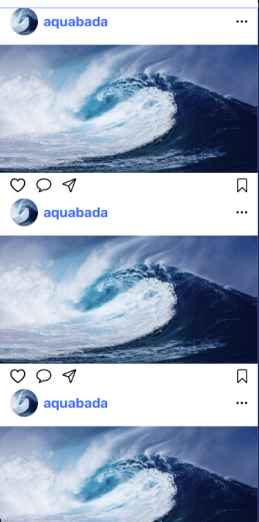
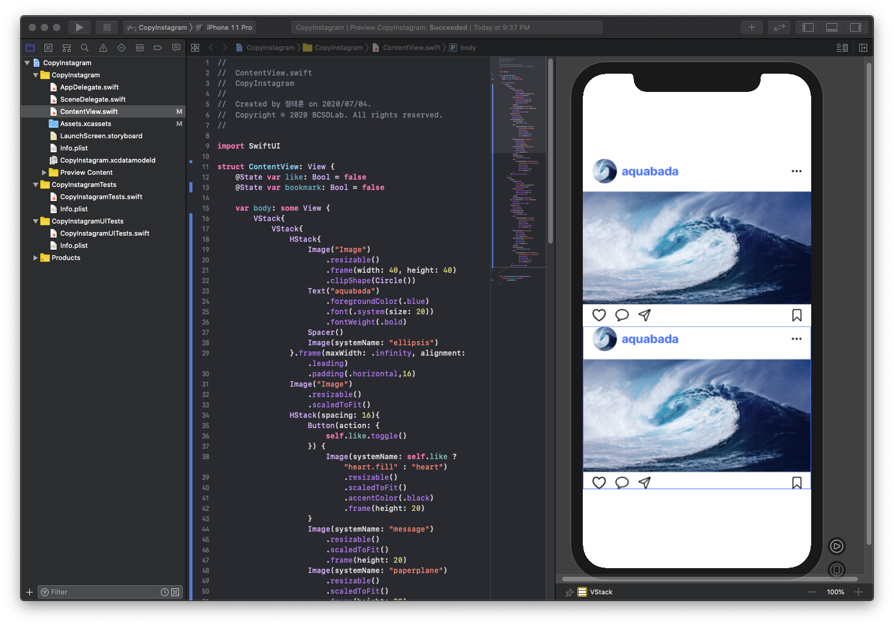
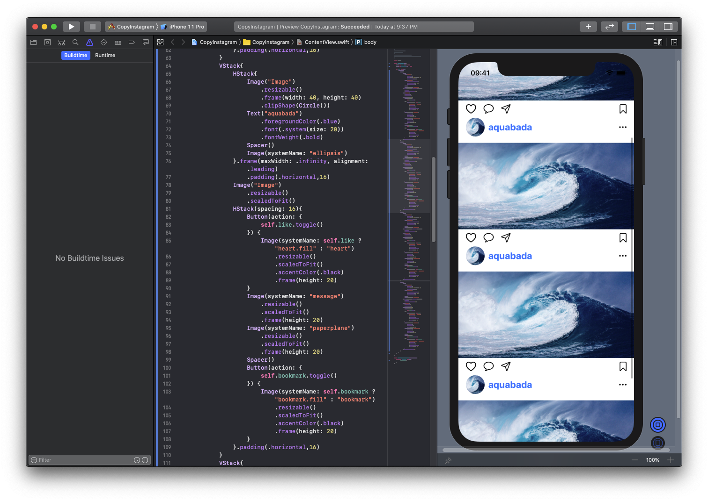
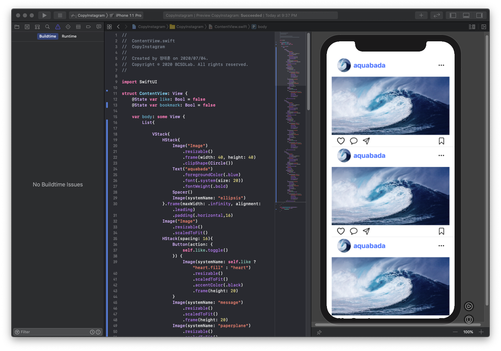
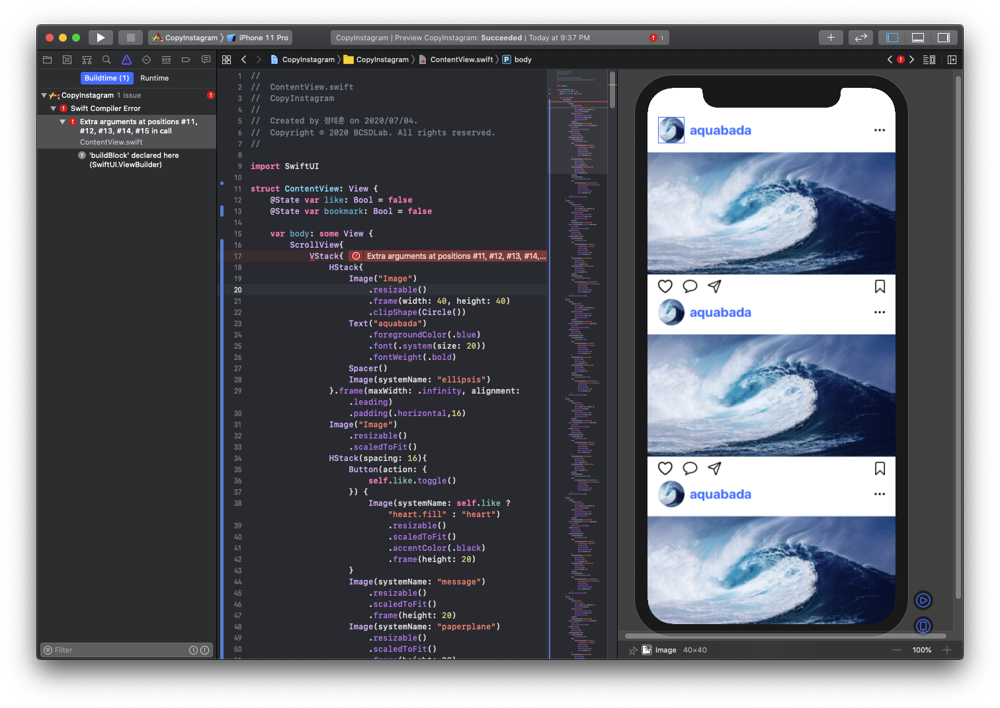
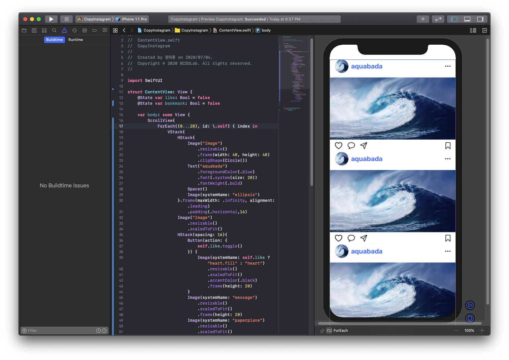

# 여러 개의 사진 보여주기\(ScrollView, List, ForEach\)

목표 : 여러 개의 사진을 보여줄 수 있습니다. 



먼저 VStack을 이용해 두, 세개의 사진을 넣어주도록 합시다.

```swift
var body: some View {
        VStack{
            VStack{ // 첫번째
                HStack{
                    Image("Image")
                        .resizable()
                        .frame(width: 40, height: 40)
                        .clipShape(Circle())
                    Text("aquabada")
                        .foregroundColor(.blue)
                        .font(.system(size: 20))
                        .fontWeight(.bold)
                    Spacer()
                    Image(systemName: "ellipsis")
                }.frame(maxWidth: .infinity, alignment: .leading)
                    .padding(.horizontal,16)
                Image("Image")
                    .resizable()
                    .scaledToFit()
                HStack(spacing: 16){
                    Button(action: {
                        self.like.toggle()
                    }) {
                        Image(systemName: self.like ? "heart.fill" : "heart")
                            .resizable()
                            .scaledToFit()
                            .accentColor(.black)
                            .frame(height: 20)
                    }
                    Image(systemName: "message")
                        .resizable()
                        .scaledToFit()
                        .frame(height: 20)
                    Image(systemName: "paperplane")
                        .resizable()
                        .scaledToFit()
                        .frame(height: 20)
                    Spacer()
                    Button(action: {
                        self.bookmark.toggle()
                    }) {
                        Image(systemName: self.bookmark ? "bookmark.fill" : "bookmark")
                            .resizable()
                            .scaledToFit()
                            .accentColor(.black)
                            .frame(height: 20)
                    }
                }.padding(.horizontal,16)
            }
            VStack{ // 두번째
                HStack{
                    Image("Image")
                        .resizable()
                        .frame(width: 40, height: 40)
                        .clipShape(Circle())
                    Text("aquabada")
                        .foregroundColor(.blue)
                        .font(.system(size: 20))
                        .fontWeight(.bold)
                    Spacer()
                    Image(systemName: "ellipsis")
                }.frame(maxWidth: .infinity, alignment: .leading)
                    .padding(.horizontal,16)
                Image("Image")
                    .resizable()
                    .scaledToFit()
                HStack(spacing: 16){
                    Button(action: {
                        self.like.toggle()
                    }) {
                        Image(systemName: self.like ? "heart.fill" : "heart")
                            .resizable()
                            .scaledToFit()
                            .accentColor(.black)
                            .frame(height: 20)
                    }
                    Image(systemName: "message")
                        .resizable()
                        .scaledToFit()
                        .frame(height: 20)
                    Image(systemName: "paperplane")
                        .resizable()
                        .scaledToFit()
                        .frame(height: 20)
                    Spacer()
                    Button(action: {
                        self.bookmark.toggle()
                    }) {
                        Image(systemName: self.bookmark ? "bookmark.fill" : "bookmark")
                            .resizable()
                            .scaledToFit()
                            .accentColor(.black)
                            .frame(height: 20)
                    }
                }.padding(.horizontal,16)
            }
        }
    }
```



하지만 2개 이상 하면 사진이 잘리고, 밑으로 내려가지지가 않습니다. 그래서 스크롤하기 위해 맨 상위 뷰를 VStack에서 ScrollView로 바꿔보도록 합시다.

```swift
var body: some View {
      ScrollView{ // 스크롤이 가능하게 해줍니다.
            VStack{
                HStack{
                    Image("Image")
                        .resizable()
                        .frame(width: 40, height: 40)
                        .clipShape(Circle())
                    Text("aquabada")
                        .foregroundColor(.blue)
                        .font(.system(size: 20))
                        .fontWeight(.bold)
                    Spacer()
                    Image(systemName: "ellipsis")
                }.frame(maxWidth: .infinity, alignment: .leading)
                    .padding(.horizontal,16)
                Image("Image")
                    .resizable()
                    .scaledToFit()
                HStack(spacing: 16){
                    Button(action: {
                        self.like.toggle()
                    }) {
                        Image(systemName: self.like ? "heart.fill" : "heart")
                            .resizable()
                            .scaledToFit()
                            .accentColor(.black)
                            .frame(height: 20)
                    }
                    Image(systemName: "message")
                        .resizable()
                        .scaledToFit()
                        .frame(height: 20)
                    Image(systemName: "paperplane")
                        .resizable()
                        .scaledToFit()
                        .frame(height: 20)
                    Spacer()
                    Button(action: {
                        self.bookmark.toggle()
                    }) {
                        Image(systemName: self.bookmark ? "bookmark.fill" : "bookmark")
                            .resizable()
                            .scaledToFit()
                            .accentColor(.black)
                            .frame(height: 20)
                    }
                }.padding(.horizontal,16)
            }
            VStack{ // 두번째
                HStack{
                    Image("Image")
                        .resizable()
                        .frame(width: 40, height: 40)
                        .clipShape(Circle())
                    Text("aquabada")
                        .foregroundColor(.blue)
                        .font(.system(size: 20))
                        .fontWeight(.bold)
                    Spacer()
                    Image(systemName: "ellipsis")
                }.frame(maxWidth: .infinity, alignment: .leading)
                    .padding(.horizontal,16)
                Image("Image")
                    .resizable()
                    .scaledToFit()
                HStack(spacing: 16){
                    Button(action: {
                        self.like.toggle()
                    }) {
                        Image(systemName: self.like ? "heart.fill" : "heart")
                            .resizable()
                            .scaledToFit()
                            .accentColor(.black)
                            .frame(height: 20)
                    }
                    Image(systemName: "message")
                        .resizable()
                        .scaledToFit()
                        .frame(height: 20)
                    Image(systemName: "paperplane")
                        .resizable()
                        .scaledToFit()
                        .frame(height: 20)
                    Spacer()
                    Button(action: {
                        self.bookmark.toggle()
                    }) {
                        Image(systemName: self.bookmark ? "bookmark.fill" : "bookmark")
                            .resizable()
                            .scaledToFit()
                            .accentColor(.black)
                            .frame(height: 20)
                    }
                }.padding(.horizontal,16)
            }
        }
    }
```



스크롤을 하기 위해서 ScrollView뿐만 아니라 List로도 스크롤이 가능합니다. 한번 ScrollView를 List로 바꿔보도록 합시다.

```swift
var body: some View {
      List{ // 리스트
            VStack{
                HStack{
                    Image("Image")
                        .resizable()
                        .frame(width: 40, height: 40)
                        .clipShape(Circle())
                    Text("aquabada")
                        .foregroundColor(.blue)
                        .font(.system(size: 20))
                        .fontWeight(.bold)
                    Spacer()
                    Image(systemName: "ellipsis")
                }.frame(maxWidth: .infinity, alignment: .leading)
                    .padding(.horizontal,16)
                Image("Image")
                    .resizable()
                    .scaledToFit()
                HStack(spacing: 16){
                    Button(action: {
                        self.like.toggle()
                    }) {
                        Image(systemName: self.like ? "heart.fill" : "heart")
                            .resizable()
                            .scaledToFit()
                            .accentColor(.black)
                            .frame(height: 20)
                    }
                    Image(systemName: "message")
                        .resizable()
                        .scaledToFit()
                        .frame(height: 20)
                    Image(systemName: "paperplane")
                        .resizable()
                        .scaledToFit()
                        .frame(height: 20)
                    Spacer()
                    Button(action: {
                        self.bookmark.toggle()
                    }) {
                        Image(systemName: self.bookmark ? "bookmark.fill" : "bookmark")
                            .resizable()
                            .scaledToFit()
                            .accentColor(.black)
                            .frame(height: 20)
                    }
                }.padding(.horizontal,16)
            }
            VStack{ // 두번째
                HStack{
                    Image("Image")
                        .resizable()
                        .frame(width: 40, height: 40)
                        .clipShape(Circle())
                    Text("aquabada")
                        .foregroundColor(.blue)
                        .font(.system(size: 20))
                        .fontWeight(.bold)
                    Spacer()
                    Image(systemName: "ellipsis")
                }.frame(maxWidth: .infinity, alignment: .leading)
                    .padding(.horizontal,16)
                Image("Image")
                    .resizable()
                    .scaledToFit()
                HStack(spacing: 16){
                    Button(action: {
                        self.like.toggle()
                    }) {
                        Image(systemName: self.like ? "heart.fill" : "heart")
                            .resizable()
                            .scaledToFit()
                            .accentColor(.black)
                            .frame(height: 20)
                    }
                    Image(systemName: "message")
                        .resizable()
                        .scaledToFit()
                        .frame(height: 20)
                    Image(systemName: "paperplane")
                        .resizable()
                        .scaledToFit()
                        .frame(height: 20)
                    Spacer()
                    Button(action: {
                        self.bookmark.toggle()
                    }) {
                        Image(systemName: self.bookmark ? "bookmark.fill" : "bookmark")
                            .resizable()
                            .scaledToFit()
                            .accentColor(.black)
                            .frame(height: 20)
                    }
                }.padding(.horizontal,16)
            }
        }
    }
```



_스크롤뷰와 리스트의 차이_

* 스크롤 뷰 : 스크롤만 가능.
* 리스트 : 스크롤 이외에 다양한 기능\(삭제, 수정, 새로고침 등\)이 가능.

하지만 스크롤과 리스트 모두 컨텐츠를 많이 넣게 되면 오류가 나올 겁니다.



오류의 뜻은 너무 많은 항목이 들어가 있기 때문인데, SwiftUI에서는 10개의 뷰 이상 넣을 수 없게 설계되어있습니다. 이 문제를 해결하려면 Group을 통해 해결할수도 있지만, 코드 간략화를 위해 같은 뷰가 반복될 때는 ForEach를 이용하여 반복시키는 게 가장 좋습니다.

```swift
ScrollView{
      ForEach((0...20), id: \.self) { index in // 20개 생성
                VStack{
                    HStack{
                        Image("Image")
                            .resizable()
                            .frame(width: 40, height: 40)
                            .clipShape(Circle())
                        Text("aquabada")
                            .foregroundColor(.blue)
                            .font(.system(size: 20))
                            .fontWeight(.bold)
                        Spacer()
                        Image(systemName: "ellipsis")
                    }.frame(maxWidth: .infinity, alignment: .leading)
                        .padding(.horizontal,16)
                    Image("Image")
                        .resizable()
                        .scaledToFit()
                    HStack(spacing: 16){
                        Button(action: {
                            self.like.toggle()
                        }) {
                            Image(systemName: self.like ? "heart.fill" : "heart")
                                .resizable()
                                .scaledToFit()
                                .accentColor(.black)
                                .frame(height: 20)
                        }
                        Image(systemName: "message")
                            .resizable()
                            .scaledToFit()
                            .frame(height: 20)
                        Image(systemName: "paperplane")
                            .resizable()
                            .scaledToFit()
                            .frame(height: 20)
                        Spacer()
                        Button(action: {
                            self.bookmark.toggle()
                        }) {
                            Image(systemName: self.bookmark ? "bookmark.fill" : "bookmark")
                                .resizable()
                                .scaledToFit()
                                .accentColor(.black)
                                .frame(height: 20)
                        }
                    }.padding(.horizontal,16)
                }
            }
        }
```



_ForEach 정의_

View를 For문 형태로 구현가능한 구조체. 대체로 두 개의 argument로 구성되어 있습니다.

```swift
ForEach((0...20), id: \.self) { index in
    Text("\(index)")
}
```

처음 argument는 범위를 설정하는 부분으로 array, dictionary 등의 id 값을 가지고 있는 객체를 이용하여 id값이나 id값에 해당하는 객체를 가져올 수 있습니다.

두번째 argument인 id는 이 id를 설정하는 부분으로, 대체로 .self를 이용하여 해당 id 그대로 사용하는 편입니다.

이제 괄호 안의 index in을 이용해 id를 이용하거나, id에 해당하는 객체를 그대로 이용할 수 있습니다.

