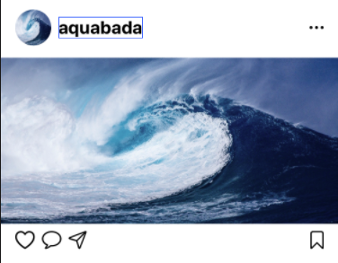
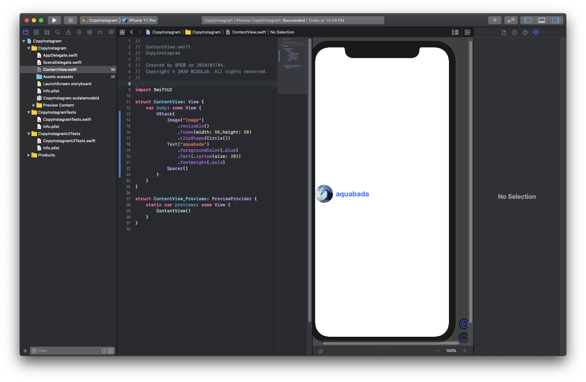
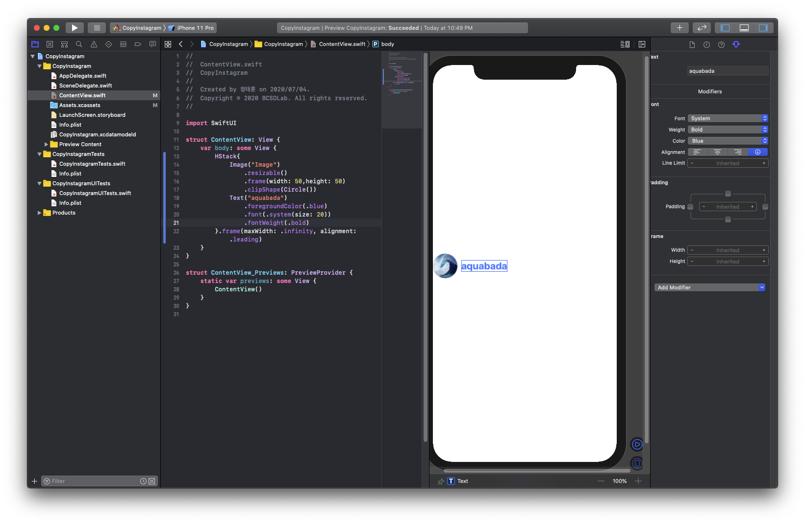
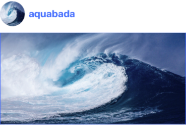
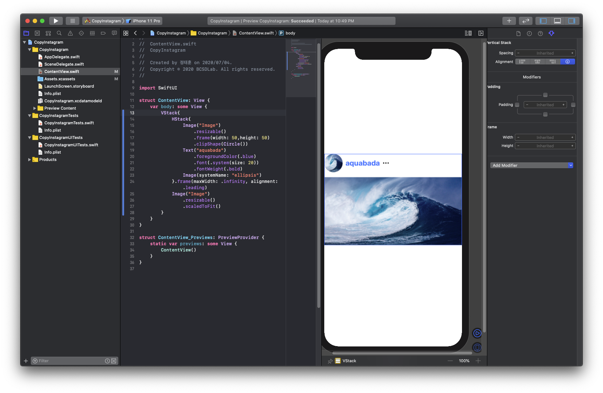
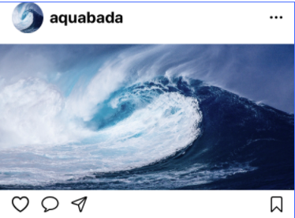

# 인스타 레이아웃 만들기\(Spacer, Padding\)

목표 : 간단한 인스타그램 레이아웃 구성하기



* Spacer의 역할
  * 나머지 공간을 빈 공간으로 하여 간단하게 정렬을 하거나, 공간을 균등하게 유지하고 싶을 때 사용.

그러면 전에 만든 프로필 사진을 Spacer를 이용하여 왼쪽 정렬을 해보도록 합니다.

```swift
var body: some View {
    HStack{
        Image("Image")
            .resizable()
            .frame(width: 50, height: 50)
            .clipShape(Circle())
        Text("aquabada")
            .foregroundColor(.blue)
            .font(.system(size: 20))
            .fontWeight(.bold)
        Spacer() // 오른쪽을 모두 여백으로 채워준다.
    }
}
```



그러면 이렇게 왼쪽 정렬이 됩니다.

그러면 Spacer없이 똑같이 왼쪽 정렬을 해보고 싶다면? 먼저 HStack의 가로 크기를 핸드폰 가로 크기까지 모두 키운 다음, 왼쪽 정렬을 하면 됩니다. 만약 HStack의 가로 크기를 키우지 않는다면 이미지와 글자 크기만 정렬이 되어 우리가 원하는 전체적인 왼쪽 정렬이 되지 않습니다.

그리고 가로 크기를 모두 키울 때 width가 아닌 maxWidth를 이용하는데, 이유는 .infinity의 경우는 Float.infinity로, 컴퓨터 Float형에 표현할 수 있는 최대 숫자를 뜻하는 것으로 이 값을 width를 하게 되면 시스템상에 오류가 나기 때문에 최대 크기로 설정하여 자동으로 휴대폰 가로 화면을 초과하지 않게 됩니다.

가로 크기를 키우는 건 .frame으로 키워주고, 왼쪽 정렬을 하는 건 frame 내부에 정렬 기능이 있으니 이를 이용해보겠습니다.

```swift
var body: some View {
    HStack{
        Image("Image")
            .resizable()
            .frame(width: 50, height: 50)
            .clipShape(Circle())
        Text("aquabada")
            .foregroundColor(.blue)
            .font(.system(size: 20))
            .fontWeight(.bold)
    }.frame(maxWidth: .infinity, alignment: .leading) // 최대 너비를 최대로, 정렬은 왼쪽 정렬로
}
```

* 참고: Alignment 명칭




이렇게 하면 이제 왼쪽 정렬도 되었으니, 이 밑에 사진을 추가해보도록 해봅시다. 전에 배웠던 것을 활용하여 다음과 같이 만들어봅시다.

* 힌트 : VStack, Image\(.resizable, .scaleToFit\) 이용



답:

```swift
var body: some View {
    VStack{
        HStack{
            Image("Image")
                .resizable()
                .frame(width: 50, height: 50)
                .clipShape(Circle())
            Text("aquabada")
                .foregroundColor(.blue)
                .font(.system(size: 20))
                .fontWeight(.bold)
        }.frame(maxWidth: .infinity, alignment: .leading)
        Image("Image")
            .resizable()
            .scaledToFit()
    }
}
```

이제 프로필 사진 끝에 메뉴를 표현해보도록 합시다. 먼저 메뉴 아이콘을 추가해보도록 합시다.

```swift
var body: some View {
    VStack{
        HStack{
            Image("Image")
                .resizable()
                .frame(width: 50, height: 50)
                .clipShape(Circle())
            Text("aquabada")
                .foregroundColor(.blue)
                .font(.system(size: 20))
                .fontWeight(.bold)
            Image(systemName: "ellipsis") // 메뉴 아이콘
        }.frame(maxWidth: .infinity, alignment: .leading)
        Image("Image")
            .resizable()
            .scaledToFit()
    }
}
```



그럼 이 아이콘을 spacer를 이용하여 맨 오른쪽으로 옮겨보도록 합시다.

```swift
var body: some View {
    VStack{
        HStack{
            Image("Image")
                .resizable()
                .frame(width: 50, height: 50)
                .clipShape(Circle())
            Text("aquabada")
                .foregroundColor(.blue)
                .font(.system(size: 20))
                .fontWeight(.bold)
            Spacer()
            Image(systemName: "ellipsis") // 메뉴 아이콘
        }.frame(maxWidth: .infinity, alignment: .leading)
        Image("Image")
            .resizable()
            .scaledToFit()
    }
}
```


완성은 했는데, 뭔가 너무 오른쪽에 치우쳐저있는 것 같습니다. 약간 여백을 줄 수 있으면 좋을 것 같습니다. 여백을 추가해보도록 합시다.

여백을 주는 방법은 다음과 같습니다.

* 오른쪽에 20 크기의 여백을 주려면,

  `.padding(.trailing, 20)`

* 왼쪽에 15 크기의 여백을 주려면,

  `.padding(.leading, 15)`

* 위쪽에 15 크기의 여백을 주려면,

  `.padding(.top, 15)`

* 전체에 10 크기의 여백을 주려면,

  `.padding(10)`

* 양 옆에 20 크기의 여백을 주려면,

  `.padding(.horizontal, 20)`

* 위, 아래에 10 크기의 여백을 주려면,

  `.padding(.vertical, 10)`

그러면 한번 메뉴 아이콘 오른쪽에 16 크기의 여백을 넣어보도록 합시다.

```swift
var body: some View {
    VStack{
        HStack{
            Image("Image")
                .resizable()
                .frame(width: 50, height: 50)
                .clipShape(Circle())
            Text("aquabada")
                .foregroundColor(.blue)
                .font(.system(size: 20))
                .fontWeight(.bold)
            Spacer()
            Image(systemName: "ellipsis")
                .padding(.trailing, 16) // 오른쪽에 16 크기의 여백
        }.frame(maxWidth: .infinity, alignment: .leading)
        Image("Image")
            .resizable()
            .scaledToFit()
    }
}
```


그럼 프로필 이미지쪽에도 왼쪽으로 16 크기의 여백을 추가해봅시다.

```swift
var body: some View {
    VStack{
        HStack{
            Image("Image")
                .resizable()
                .frame(width: 50, height: 50)
                .clipShape(Circle())
                .padding(.leading, 16)
            Text("aquabada")
                .foregroundColor(.blue)
                .font(.system(size: 20))
                .fontWeight(.bold)
            Spacer()
            Image(systemName: "ellipsis")
                .padding(.trailing, 16) // 오른쪽에 16 크기의 여백
        }.frame(maxWidth: .infinity, alignment: .leading)
        Image("Image")
            .resizable()
            .scaledToFit()
    }
}
```


지금 프로필 이미지와 메뉴 아이콘에 좌, 우로 각각 16씩 여백을 넣었는데, 이걸 다시 지원보고 이번엔 .horizontal을 이용해서 HStack에 좌우로 16씩 여백을 주도록 합시다.

\(지금부터 디자인을 위해 프로필 이미지 크기를 40으로 줄여보겠습니다.\)

```swift
var body: some View {
    VStack{
        HStack{
            Image("Image")
                .resizable()
                .frame(width: 40, height: 40) // 크기를 40으로 조절
                .clipShape(Circle())
            Text("aquabada")
                .foregroundColor(.blue)
                .font(.system(size: 20))
                .fontWeight(.bold)
            Spacer()
            Image(systemName: "ellipsis")
        }.frame(maxWidth: .infinity, alignment: .leading)
        .padding(.horizontal,16) // 좌우로 16 여백
        Image("Image")
            .resizable()
            .scaledToFit()
    }
}
```


그러면 이제 Spacer를 이용해 밑의 좋아요, 댓글, 북마크 등의 아이콘을 넣어보도록 합시다.

```swift
var body: some View {
    VStack{
        HStack{
            Image("Image")
                .resizable()
                .frame(width: 40, height: 40) // 크기를 40으로 조절
                .clipShape(Circle())
            Text("aquabada")
                .foregroundColor(.blue)
                .font(.system(size: 20))
                .fontWeight(.bold)
            Spacer()
            Image(systemName: "ellipsis")
        }.frame(maxWidth: .infinity, alignment: .leading)
        .padding(.horizontal,16) // 좌우로 16 여백
        Image("Image")
            .resizable()
            .scaledToFit()
        HStack{
            Image(systemName: "heart")
              .resizable()
              .scaledToFit()
              .frame(height: 20)
            Image(systemName: "message")
              .resizable()
              .scaledToFit()
              .frame(height: 20)
          Image(systemName: "paperplane")
              .resizable()
              .scaledToFit()
              .frame(height: 20)
          Spacer()
          Image(systemName: "bookmark")
              .resizable()
              .scaledToFit()
              .frame(height: 20)
        }
    }
}
```


이번에도 아까처럼 좌,우로 16씩 여백을 주도록 합니다.

```swift
var body: some View {
    VStack{
        HStack{
            Image("Image")
                .resizable()
                .frame(width: 40, height: 40) // 크기를 40으로 조절
                .clipShape(Circle())
            Text("aquabada")
                .foregroundColor(.blue)
                .font(.system(size: 20))
                .fontWeight(.bold)
            Spacer()
            Image(systemName: "ellipsis")
        }.frame(maxWidth: .infinity, alignment: .leading)
        .padding(.horizontal,16) // 좌우로 16 여백
        Image("Image")
            .resizable()
            .scaledToFit()
        HStack{
            Image(systemName: "heart")
              .resizable()
              .scaledToFit()
              .frame(height: 20)
            Image(systemName: "message")
              .resizable()
              .scaledToFit()
              .frame(height: 20)
          Image(systemName: "paperplane")
              .resizable()
              .scaledToFit()
              .frame(height: 20)
          Spacer()
          Image(systemName: "bookmark")
              .resizable()
              .scaledToFit()
              .frame(height: 20)
        }.padding(.horizontal,16)
    }
}
```


* 응용: HStack에 각 아이콘 사이에 16씩 여백을 줘봅시다.

  * padding, Spacing을 사용하지 않습니다.
  * HStack 자체에 있는 기능을 이용합니다.\(힌트: spacing\)
  * 한번 구글에 검색해서 구현해보세요~



답 :

```swift
var body: some View {
    VStack{
        HStack{
            Image("Image")
                .resizable()
                .frame(width: 40, height: 40) // 크기를 40으로 조절
                .clipShape(Circle())
            Text("aquabada")
                .foregroundColor(.blue)
                .font(.system(size: 20))
                .fontWeight(.bold)
            Spacer()
            Image(systemName: "ellipsis")
        }.frame(maxWidth: .infinity, alignment: .leading)
        .padding(.horizontal,16) // 좌우로 16 여백
        Image("Image")
            .resizable()
            .scaledToFit()
        HStack(spacing: 16){
            Image(systemName: "heart")
              .resizable()
              .scaledToFit()
              .frame(height: 20)
            Image(systemName: "message")
              .resizable()
              .scaledToFit()
              .frame(height: 20)
          Image(systemName: "paperplane")
              .resizable()
              .scaledToFit()
              .frame(height: 20)
          Spacer()
          Image(systemName: "bookmark")
              .resizable()
              .scaledToFit()
              .frame(height: 20)
        }.padding(.horizontal,16)
    }
}
```


