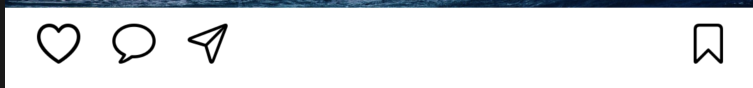
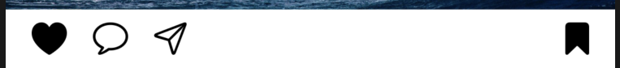
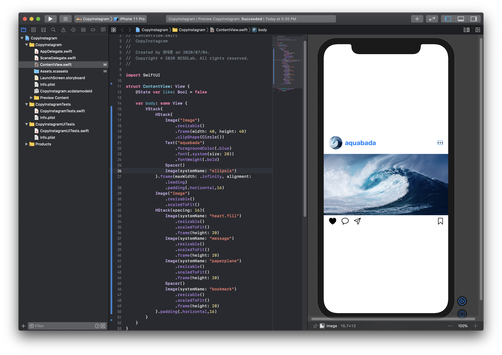
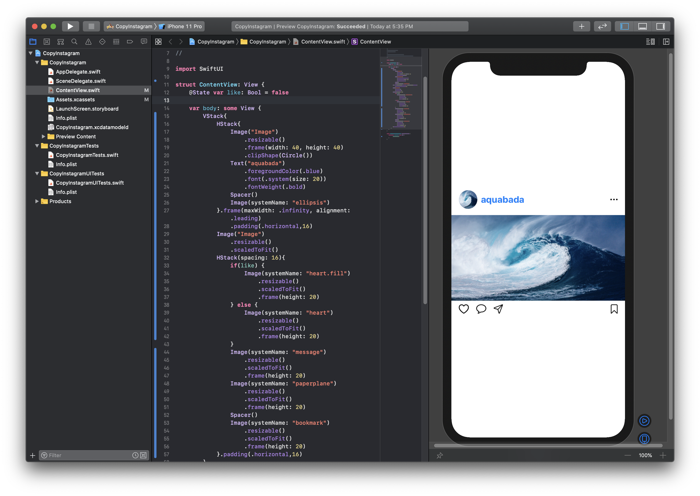
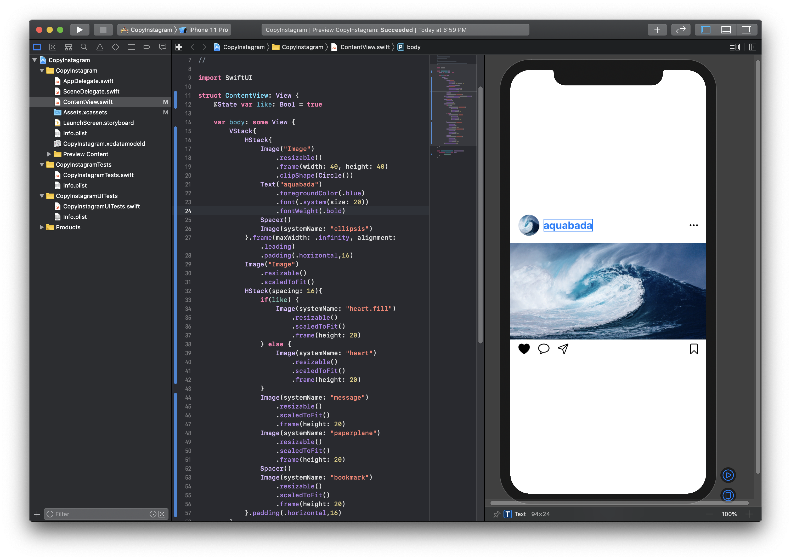
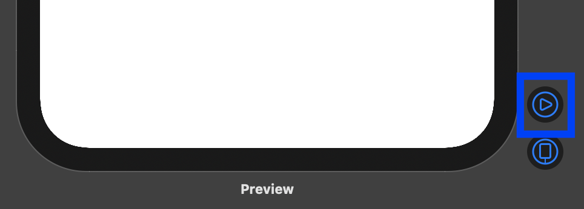
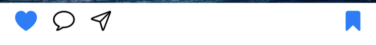

# 좋아요 버튼 만들기\(State, Button\)


목표: 좋아요, 북마크 버튼을 누르면 하트 색을 검정색으로 바뀌게 할 수 있습니다. 





먼저 하트 부분을 검은 색으로 바꿔봅시다. heart를 heart.fill로 바꿔줍시다.

```swift
var body: some View {
        VStack{
            HStack{
                Image("Image")
                    .resizable()
                    .frame(width: 40, height: 40)
                    .clipShape(Circle())
                Text("aquabada")
                    .foregroundColor(.blue)
                    .font(.system(size: 20))
                    .fontWeight(.bold)
                Spacer()
                Image(systemName: "ellipsis")
            }.frame(maxWidth: .infinity, alignment: .leading)
                .padding(.horizontal,16)
            Image("Image")
                .resizable()
                .scaledToFit()
            HStack(spacing: 16){
                Image(systemName: "heart.fill")
                    .resizable()
                    .scaledToFit()
                    .frame(height: 20)
                Image(systemName: "message")
                    .resizable()
                    .scaledToFit()
                    .frame(height: 20)
                Image(systemName: "paperplane")
                    .resizable()
                    .scaledToFit()
                    .frame(height: 20)
                Spacer()
                Image(systemName: "bookmark")
                    .resizable()
                    .scaledToFit()
                    .frame(height: 20)
            }.padding(.horizontal,16)
        }
    }
```



그러면 이걸 if-else를 이용해 true일 때는 색칠된 형태로, false일 때는 색칠 안된 형태로 바꿔주도록 합시다.

먼저 var body 줄 위에 다음과 같은 줄을 넣어줍시다.

```swift
struct ContentView: View {
    @State var like: Bool = false // 좋아요 상태를 표시해주는 변수

    var body: some View {
```

> @State는 SwiftUI에서 뷰가 해당 값에 접근 가능하게 해주는 Property Wrapper로, 쉽게 얘기하면 값을 변경할 때 사용하는 어노테이션입니다.

우리는 True, False로 값을 변경해줘야하기에 이 State를 사용해보도록 합시다.

그러면 이제 if-else를 넣어봅시다.

```swift
    var body: some View {
        VStack{
            HStack{
                Image("Image")
                    .resizable()
                    .frame(width: 40, height: 40)
                    .clipShape(Circle())
                Text("aquabada")
                    .foregroundColor(.blue)
                    .font(.system(size: 20))
                    .fontWeight(.bold)
                Spacer()
                Image(systemName: "ellipsis")
            }.frame(maxWidth: .infinity, alignment: .leading)
                .padding(.horizontal,16)
            Image("Image")
                .resizable()
                .scaledToFit()
            HStack(spacing: 16){
                if(like) { // 만약 like가 True이면
                    Image(systemName: "heart.fill") // 칠한 얘로
                        .resizable()
                        .scaledToFit()
                        .frame(height: 20)
                } else { // like가 False이면
                    Image(systemName: "heart") // 칠하지 않은 얘로
                        .resizable()
                        .scaledToFit()
                        .frame(height: 20)
                }
                Image(systemName: "message")
                    .resizable()
                    .scaledToFit()
                    .frame(height: 20)
                Image(systemName: "paperplane")
                    .resizable()
                    .scaledToFit()
                    .frame(height: 20)
                Spacer()
                Image(systemName: "bookmark")
                    .resizable()
                    .scaledToFit()
                    .frame(height: 20)
            }.padding(.horizontal,16)
        }
    }
```

그러면 만약에 like를 false로 할 때는



 이렇게 칠하지 않은 상태로 되어있고

like를 true로 바꿔주면

```swift
struct ContentView: View {
    @State var like: Bool = true

    var body: some View {
```



 이렇게 칠한 상태로 바뀌게 됩니다.

그럼 이걸 이제 누를 때마다 바뀌게 해보도록 합시다.

Button으로 해봅시다.

버튼의 형태는 다음과 같습니다.

```swift
Button(
action: {
    // 버튼이 눌릴 때 어떻게 동작할 것인지 설정.
}) {
    // 버튼의 형태를 설정.
}
```

그러면 이제 if-else 부분을 버튼으로 감싸보겠습니다.

여기서 `self.like.toggle` 은 action 부분은 또 다른 함수 부분이라 외부 변수에 해당되는 like를 불러오기 위해 self.like를 이용해야하며, toggle의 경우 토글 버튼처럼 false일때는 true로, true일때는 false로 바꿔주는 편리한 기능입니다. 똑같이 구현하려면 `self.toggle = !self.toggle`로도 구현할 수 있습니다.

```swift
var body: some View {
        VStack{
            HStack{
                Image("Image")
                    .resizable()
                    .frame(width: 40, height: 40)
                    .clipShape(Circle())
                Text("aquabada")
                    .foregroundColor(.blue)
                    .font(.system(size: 20))
                    .fontWeight(.bold)
                Spacer()
                Image(systemName: "ellipsis")
            }.frame(maxWidth: .infinity, alignment: .leading)
                .padding(.horizontal,16)
            Image("Image")
                .resizable()
                .scaledToFit()
            HStack(spacing: 16){
                Button( // 버튼 생성
                    action: {  // 버튼을 누를 때 동작하는 액션
                    self.like.toggle() // true일때는 false, false일때는 true로 변경
                }) {
                    if(like) {
                        Image(systemName: "heart.fill") // true일 때는 칠한 하트로
                            .resizable()
                            .scaledToFit()
                            .frame(height: 20)
                    } else {
                        Image(systemName: "heart") // false일때는 그냥 하트로
                            .resizable()
                            .scaledToFit()
                            .frame(height: 20)
                    }
                }
                Image(systemName: "message")
                    .resizable()
                    .scaledToFit()
                    .frame(height: 20)
                Image(systemName: "paperplane")
                    .resizable()
                    .scaledToFit()
                    .frame(height: 20)
                Spacer()
                Image(systemName: "bookmark")
                    .resizable()
                    .scaledToFit()
                    .frame(height: 20)
            }.padding(.horizontal,16)
        }
    }
```

동작을 테스트하기 위해 프리뷰 부분에 실행 버튼을 눌러봅시다. 



로딩이 끝난 후에 하트 부분을 누르면 칠해졌다 안 칠해졌다 구현할 수 있게 됩니다.

근데 if-else를 이용하지 않고 이미지 이름만 바꿔주면 되는데 코드가 약간 낭비되는 느낌이에요. 여기서 삼항 연산자를 다시 알아봅시다.

> _삼항 연산자_는 if-else를 간략하게 표한할 수 있는 형태로, true, false만으로 표현해도 될 때 많이 사용하는 형태입니다.

`self.like ? "heart.fill" : "heart"`

> 여기서 true,false 값을 결정하는 곳은 물음표\(?\) 표시 왼쪽에 있는 얘가 담당하며, 이 값이 true일 때 : 표시 왼쪽에 있는 “heart.fill”로 바꿔주고, false이면 : 표시 오른쪽에 있는 “heart”로 바꿔줍니다.

그러면 이걸 이용해서 systemName 부분만 바꿔보도록 합시다.

```swift
var body: some View {
        VStack{
            HStack{
                Image("Image")
                    .resizable()
                    .frame(width: 40, height: 40)
                    .clipShape(Circle())
                Text("aquabada")
                    .foregroundColor(.blue)
                    .font(.system(size: 20))
                    .fontWeight(.bold)
                Spacer()
                Image(systemName: "ellipsis")
            }.frame(maxWidth: .infinity, alignment: .leading)
                .padding(.horizontal,16)
            Image("Image")
                .resizable()
                .scaledToFit()
            HStack(spacing: 16){
                Button(action: {
                    self.like.toggle()
                }) {
                    Image(systemName: self.like ? "heart.fill" : "heart") // like가 true이면 칠한하트, 아니면 그냥 하트로 바꿔주는 걸 한줄로 변경
                        .resizable()
                        .scaledToFit()
                        .frame(height: 20)
                }
                Image(systemName: "message")
                    .resizable()
                    .scaledToFit()
                    .frame(height: 20)
                Image(systemName: "paperplane")
                    .resizable()
                    .scaledToFit()
                    .frame(height: 20)
                Spacer()
                Image(systemName: "bookmark")
                    .resizable()
                    .scaledToFit()
                    .frame(height: 20)
            }.padding(.horizontal,16)
        }
    }
```

실행해보면 아까와 같은 결과가 나오게 됩니다.

복습 : 이번엔 북마크도 똑같이 해봅시다.



* like와 같이 body 윗 줄에 bookmark로 State를 추가해야합니다.
* 북마크 칠한 걸 사용하고 싶으실 때는 “bookmark.fill”을, 안 칠한 걸 사용하고 싶으실 때는 “bookmark”를 이용하시면 됩니다.
* 버튼을 누를 때는 bookmark가 toggle이 되어야합니다.
* 위에 배웠던 삼항 연산자를 사용하시는 걸 추천드립니다.

답:

```swift
@State var like: Bool = false
@State var bookmark: Bool = false // 북마크용 State

    var body: some View {
        VStack{
            HStack{
                Image("Image")
                    .resizable()
                    .frame(width: 40, height: 40)
                    .clipShape(Circle())
                Text("aquabada")
                    .foregroundColor(.blue)
                    .font(.system(size: 20))
                    .fontWeight(.bold)
                Spacer()
                Image(systemName: "ellipsis")
            }.frame(maxWidth: .infinity, alignment: .leading)
                .padding(.horizontal,16)
            Image("Image")
                .resizable()
                .scaledToFit()
            HStack(spacing: 16){
                Button(action: {
                    self.like.toggle()
                }) {
                    Image(systemName: self.like ? "heart.fill" : "heart")
                        .resizable()
                        .scaledToFit()
                        .frame(height: 20)
                }
                Image(systemName: "message")
                    .resizable()
                    .scaledToFit()
                    .frame(height: 20)
                Image(systemName: "paperplane")
                    .resizable()
                    .scaledToFit()
                    .frame(height: 20)
                Spacer()
                Button(action: {
                    self.bookmark.toggle() // 북마크 토글
                }) {
                    Image(systemName: self.bookmark ? "bookmark.fill" : "bookmark") // 북마크가 true일 때 칠해진 얘로, 아니면 그냥 북마크로
                        .resizable()
                        .scaledToFit()
                        .frame(height: 20)
                }
            }.padding(.horizontal,16)
        }
    }
```

응용 : 하트, 북마크 칠해진 색이 파란색이 아닌 검정색으로 바꿔봅시다! 


* Image 내에 있는 함수 이용
* accent 색을 변경해주어야합니다.\(accent: 버튼 강조 표시\)
* 검정색으로 바꿔줍시다.

답:

```swift
var body: some View {
        VStack{
            HStack{
                Image("Image")
                    .resizable()
                    .frame(width: 40, height: 40)
                    .clipShape(Circle())
                Text("aquabada")
                    .foregroundColor(.blue)
                    .font(.system(size: 20))
                    .fontWeight(.bold)
                Spacer()
                Image(systemName: "ellipsis")
            }.frame(maxWidth: .infinity, alignment: .leading)
                .padding(.horizontal,16)
            Image("Image")
                .resizable()
                .scaledToFit()
            HStack(spacing: 16){
                Button(action: {
                    self.like.toggle()
                }) {
                    Image(systemName: self.like ? "heart.fill" : "heart")
                        .resizable()
                        .scaledToFit()
                        .accentColor(.black) // 검은 색으로 변경
                        .frame(height: 20)
                }
                Image(systemName: "message")
                    .resizable()
                    .scaledToFit()
                    .frame(height: 20)
                Image(systemName: "paperplane")
                    .resizable()
                    .scaledToFit()
                    .frame(height: 20)
                Spacer()
                Button(action: {
                    self.bookmark.toggle()
                }) {
                    Image(systemName: self.bookmark ? "bookmark.fill" : "bookmark")
                        .resizable()
                        .scaledToFit()
                        .accentColor(.black) // 검은 색으로 변경
                        .frame(height: 20)
                }
            }.padding(.horizontal,16)
        }
    }
```

