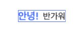
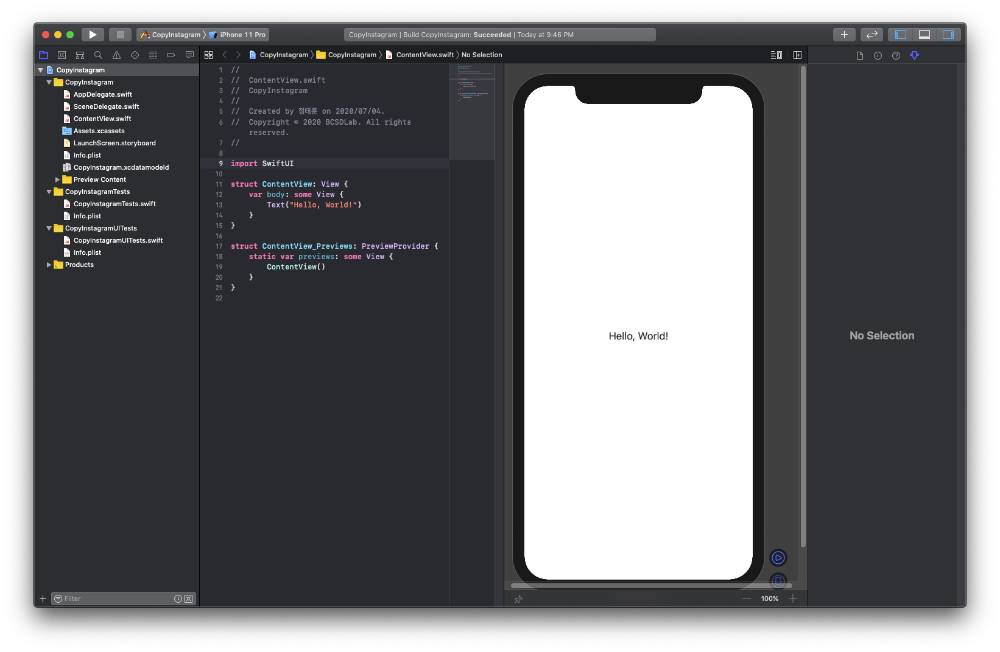
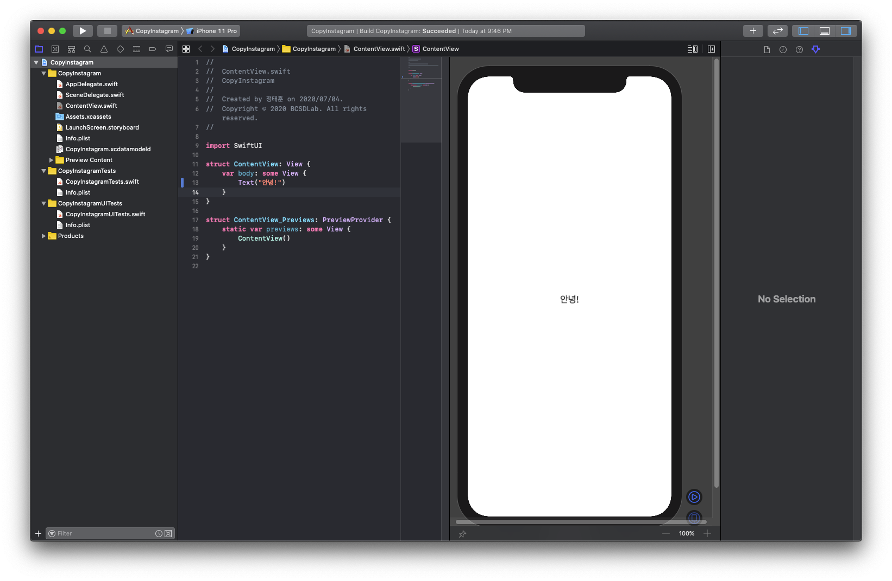
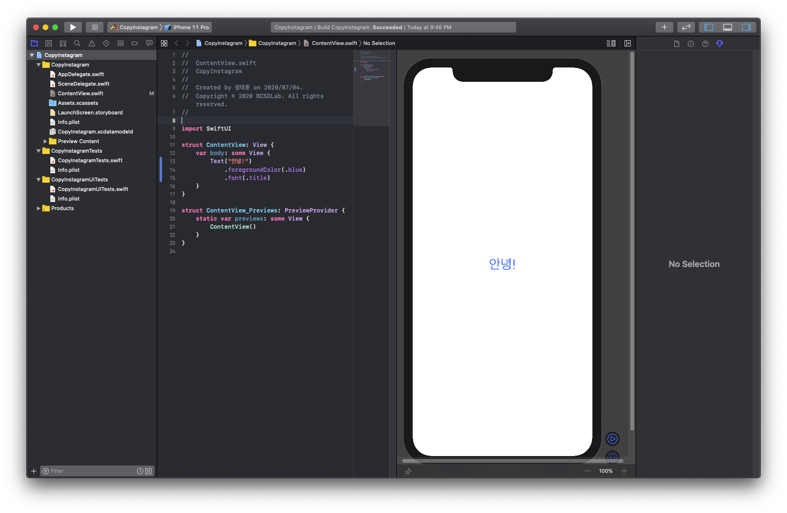
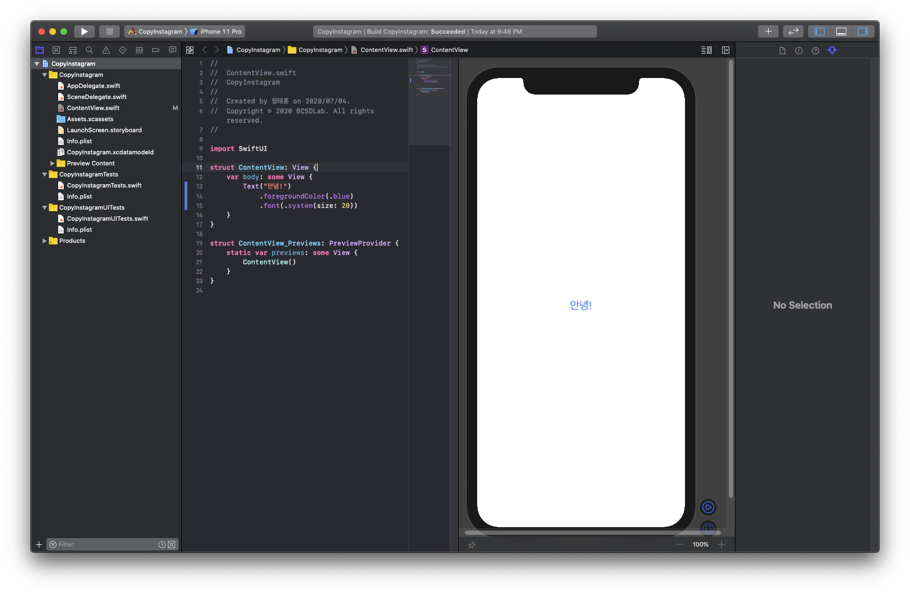
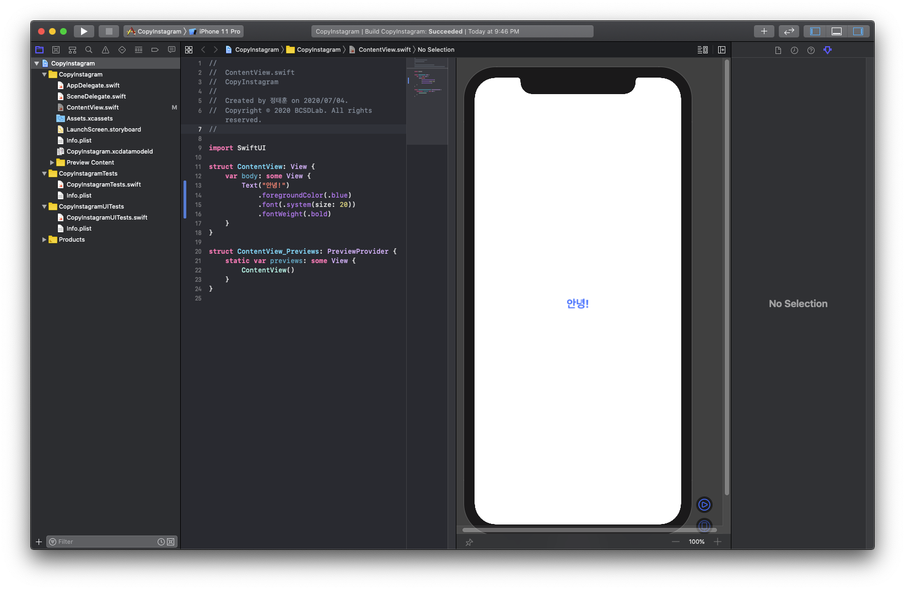
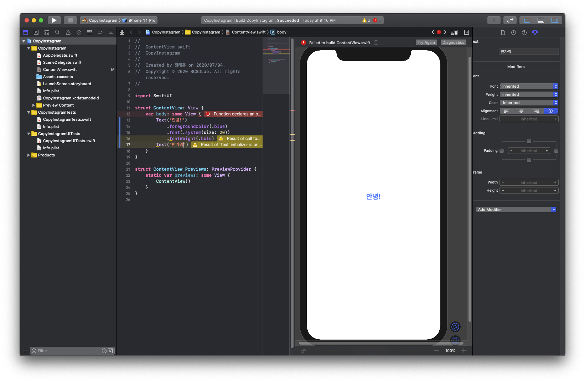
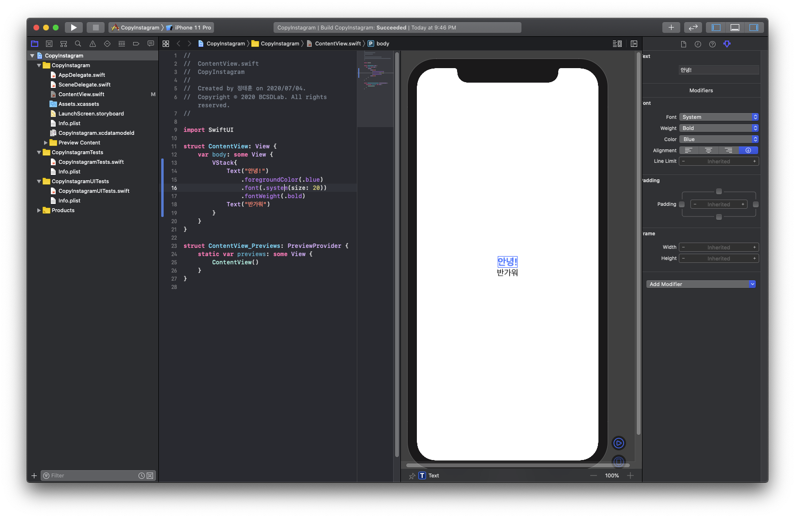

# 글자 넣기\(Text, VStack, HStack\)


* 목표: 글자에 색을 칠하고, 크기 조절, 두껍게 만들어줍시다!



먼저 기본 프로젝트를 생성해주면 다음과 같이 “Hello, World”란 글자가 뜹니다. 



한번 저 Hello, World란 글자를 원하는 글자로 바꿔줍시다.

```swift
Text("안녕!")         // 큰 따옴표 안의 글자를 변경해준다.
```



그러면 이제 글자 색도 한번 파란색으로 바꿔보도록 하겠습니다.

```swift
Text("안녕!")
    .foregroundColor(.blue)  // 파란색으로 변경
```

위의 코드의 .blue는 간단히 표현가능한 방식이며, 원래 코드는 다음과 같습니다.

```swift
Text("안녕!")
    .foregroundColor(Color.blue)  // Color.blue와 .blue는 같은 표현
```


* 응용 : .blue, Color.blue를 이용하지 않고 파란색을 표현해봅시다!
  * 컴퓨터에서 주로 다루는 색은 RGB 색으로 빨강, 초록, 파란색을 각각 0~255의 정도로 구분하여 섞는 방식으로 이루어집니다.
  * 예를 들어 파란색을 만든다면 파란색을 제외한 나머지 색은 필요 없으므로 빨강, 파란색을 0을, 파란색을 255를 넣은 \(빨강색: 0, 초록색:0, 파란색:255\)로 표현될 수 있습니다.
  * SwiftUI에서는 이 0~255를 0~1 사이의 유리수 값으로 표현해주기 때문에 기존 값에서 255를 나눠주면 됩니다. \(빨강색: 0/255, 초록색:0/255, 파란색:255/255\)
  * 구현 방법은 다음 코드와 같습니다. 

```swift
Text("안녕!")
    .foregroundColor(Color(red: 0/255, green: 0/255, blue: 255/255)) // 255/255를 1, 0/255는 0과 같습니다.
```

그 다음에 글자 크기를 키워보도록 합시다.

```swift
Text("안녕!")
    .foregroundColor(.blue)
    .font(.title) // 글자 크기를 Title(제목)의 크기로 변경
```



그냥 Title 크기로 키우는 걸 원하지 않고, 사이즈를 20 크기로 조절하려면 다음과 같이 해줍니다. 대부분 글자 크기를 설정할 때는 이렇게 설정하면 됩니다.

```swift
Text("안녕!")
    .foregroundColor(.blue)
    .font(.system(size: 20)) // 글자 크기를 20으로 설정
```



글자를 두껍게 해주려면 다음과 같이 해줍니다.

```swift
Text("안녕!")
    .foregroundColor(.blue)
    .font(.system(size: 20))
    .fontWeight(.bold) // 폰트 두께를 두껍게(.bold) 설정
```



글자를 하나 더 넣어볼까요? 한번 Text를 더 넣어봅시다.

```swift
Text("안녕!")
    .foregroundColor(.blue)
    .font(.system(size: 20))
    .fontWeight(.bold)
Text("반가워")  // 에러!!
```



짜잔~ 보시는 것과 같이 오류가 납니다! 그러면 글자를 두개 추가하는 건 불가능할까요?

글자를 추가하려면 다음과 같이 Text들에 VStack을 감싸줍시다.

```swift
VStack { // VStack은 Vertical Stack으로 세로로 하나씩 쌓는 뷰
    Text("안녕!")
    .foregroundColor(.blue)
    .font(.system(size: 20))
    .fontWeight(.bold)
    Text("반가워")
}
```



VStack은 Vertical Stack으로 세로로 쌓는 뷰를 뜻하여 여러개의 뷰를 세로로 여러 개를 추가할 때 사용합니다.

만약 가로로 여러개의 뷰를 추가하려면? Horizontal Stack을 뜻하는 HStack을 이용합니다.

```swift
HStack { // HStack은 Horizontal Stack으로 세로로 하나씩 쌓는 뷰
    Text("안녕!")
    .foregroundColor(.blue)
    .font(.system(size: 20))
    .fontWeight(.bold)
    Text("반가워")
}
```


