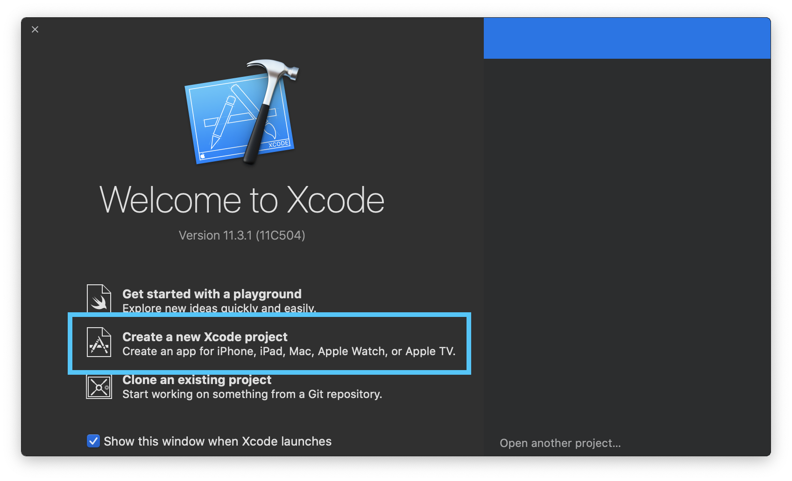
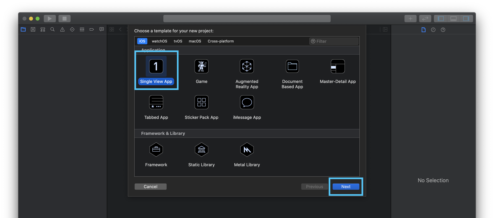
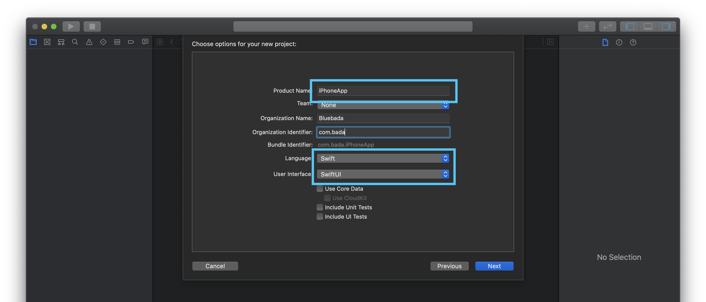
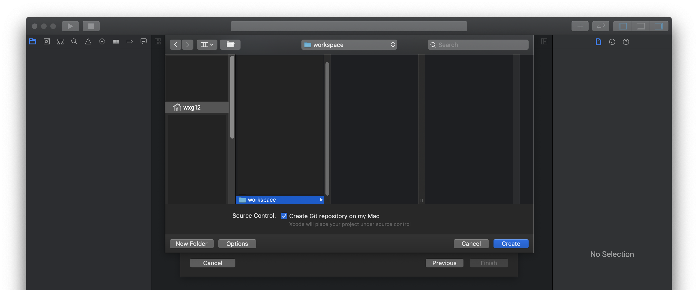

# 프로젝트 만들기

1. Xcode를 열고, \[Create a new Xcode project\]를 눌러 프로젝트를 만들어봅시다.

2. iOS 탭의 \[Single View App\]을 선택한 다음, \[Next\] 버튼을 눌러 다음 화면으로 이동합니다.

3. 프로젝트 이름을 작성한 후에, 언어는 "Swift"로, 유저 인터페이스는 "SwiftUI"로 선택한 후 다음 화면으로 이동합니다.

4. 프로젝트 저장 위치를 설정한 후, \[Create\] 버튼을 눌러 프로젝트 생성을 마칩니다.

