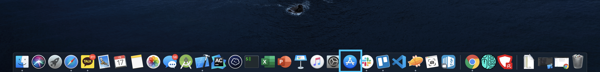
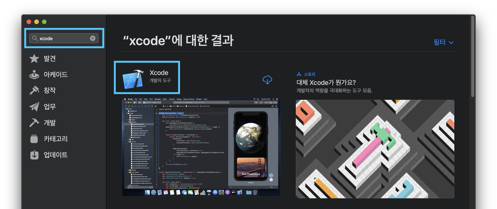
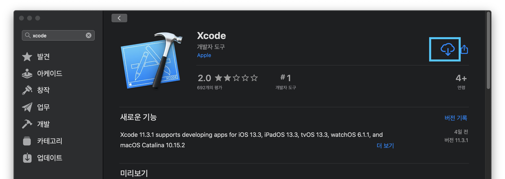
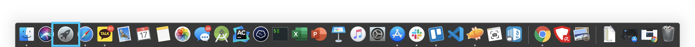
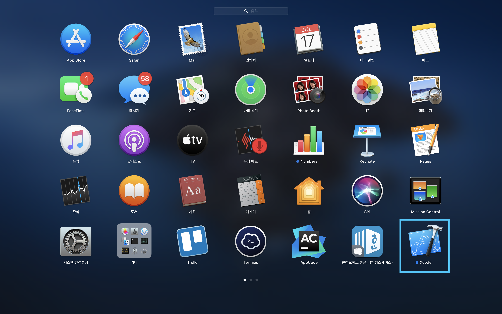

# Xcode설치

1. 표시되어있는 앱스토어를 실행합니다.

2. 왼쪽 윗부분의 검색 창에 "xcode"를 입력하여 검색결과에 맨 처음에 나오는 \[Xcode\] 아이콘을 클릭합니다.

3. Xcode에 대한 설명이 나오면, 여기서 \[받기\] 버튼을 클릭하여 설치를 합니다. \(조금 오래 걸립니다.\)

4. Xcode 설치가 끝나면, Xcode를 실행해봅시다. 런치패드\(로켓 모양\) 아이콘을 클릭해봅시다.

5. 런치패드를 열 설치된 Xcode의 아이콘을 확인할 수 있습니다. 이 아이콘을 클릭해 실행하면 됩니다.

