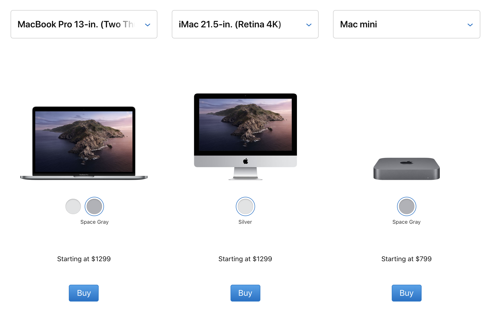

# Xcode 설치할 때 준비물

먼저 아이폰 개발에 쓰는 Xcode를 설치하려면 준비물 하나만 있으면 됩니다.

> Mac이 설치되어있는 컴퓨터\(맥북, 아이맥, 맥미니, 맥프로\)

이 하나만으로 아이폰 개발에 큰 장벽을 만나게 됩니다.

왜 굳이 Mac을 사용해야하는 이유가 궁금한 분들도 있는데, 이유는 단순하게도 Xcode가 Mac에서만 동작이 되기 때문입니다. 간혹 윈도우에 설치할 수 있게 개조된 Mac인 해킨토시를 일반 컴퓨터에 설치해서 하는 방법을 시도하고 있는데, 추천드리지는 않습니다. 필자가 예전에 설치해본 바로는 운영체제 자체가 매우 불안해서 Xcode는 커녕 Mac에서 프레젠테이션을 만들어주는 "Keynote"도 실행되기도 전에 오류가 뜨는 것을 보면서 바로 포기했습니다. 그러니 차라리 마음 편하게 Mac 컴퓨터를 사는 것을 추천합니다.

만약 이러한 장벽을 극복하셨으면,  축하드립니다! 당분간은 큰 문제 없이 개발이 가능합니다. 아이폰이 없어도 시뮬레이터가 있어서 큰 문제 없이 개발이 가능하고, 애플 개발자 프로그램 등록비\(1년 99달러\)도 어플을 다 만들고 난 후에 생각해도 문제 없습니다.

